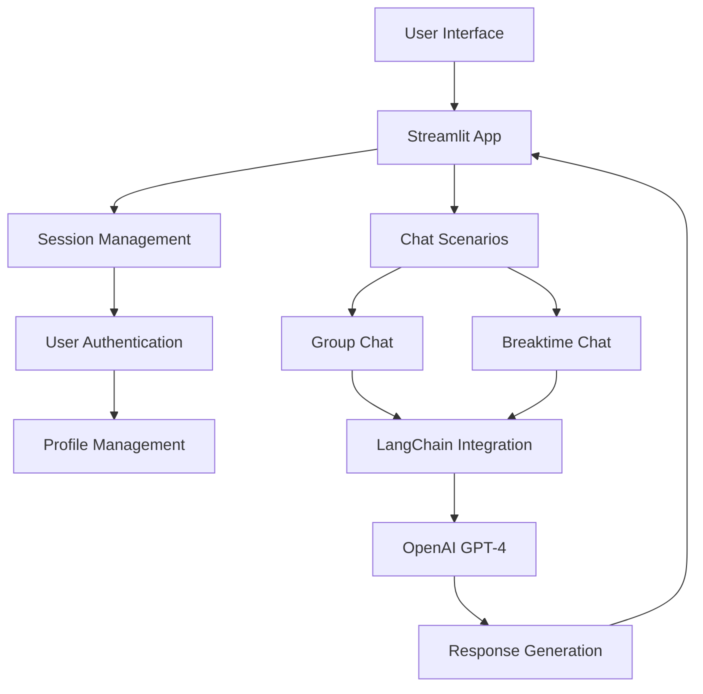

# Architecture Overview

## System Architecture

EngageBot is built using a modern web application architecture with the following components:

### Frontend
- **Streamlit**: Web framework for building the user interface
- **Session Management**: Handles user state and conversation history
- **Responsive Design**: Adapts to different screen sizes

### Backend
- **Python**: Core programming language
- **LangChain**: AI integration framework
- **OpenAI GPT-4**: Language model for conversation generation

### Data Storage
- **JSON Files**: User profiles and conversation history
- **Session State**: Temporary storage for active conversations

## Component Interaction

## Key Components

### 1. User Authentication System
- Handles user login/logout
- Manages user sessions
- Stores user profiles

### 2. Chat Scenario Engine
- Manages different chat scenarios
- Handles conversation flow
- Maintains context between messages

### 3. AI Integration Layer
- Processes user input
- Generates appropriate responses
- Maintains conversation context

### 4. Data Management
- Stores user profiles
- Maintains conversation history
- Handles session state

## Security Considerations

1. **User Authentication**
   - Secure session management
   - Protected user data
   - Secure API key handling

2. **Data Protection**
   - Encrypted storage
   - Secure data transmission
   - Privacy compliance

## Scalability

The architecture is designed to be scalable:
- Modular design allows for easy addition of new features
- Stateless components enable horizontal scaling
- Efficient data storage and retrieval 